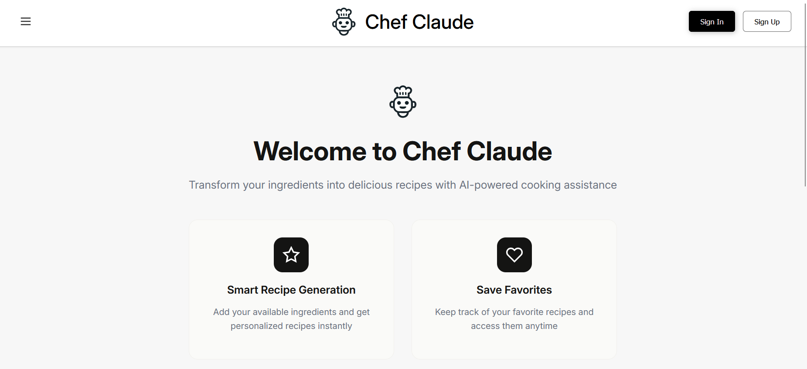

# Chef Claude 🍳
> Chef Claude is a smart recipe generator web application that helps users discover delicious recipes based on available ingredients. Users can create accounts, generate personalized recipes, save favorites, manage recipe history, and customize their cooking experience with a comprehensive profile management system.



## ✨ Features

- **🔐 User Authentication**: Secure login/signup with JWT tokens
- **🥕 Ingredient-Based Recipe Generation**: Input your available ingredients and get personalized recipes
- **💾 Recipe Management**: Save, favorite, and organize your generated recipes  
- **📚 Recipe History**: Access all your previously generated recipes
- **⭐ Favorites System**: Mark and quickly access your favorite recipes
- **👤 Profile Management**: Edit personal information, change passwords, and customize preferences
- **📱 Responsive Design**: Optimized for desktop, tablet, and mobile devices

## 🛠️ Tech Stack

**Frontend:**
- React 19 with Vite
- Context API for state management
- Native Fetch API for HTTP requests
- CSS with responsive design
- JavaScript 

**Backend:**
- Node.js with Express.js
- MongoDB with Mongoose ODM
- JWT for authentication
- bcrypt for password hashing
- CORS for cross-origin requests
- Express rate limiting for API protection
- Input validation and sanitization
- Request validation middleware using Zod

**Architecture & Best Practices:**
- RESTful API design
- Custom middleware for authentication
- Error handling middleware
- Request rate limiting
- Input validation and sanitization
- Secure authentication flow
- Database indexing for performance
- Modular code organization


**Project Structures:**
chef-claude/
├── frontend/
│   ├── src/
│   │   ├── components/           # Reusable UI components
│   │   ├── context/              # React Context for state management
│   │   ├── service/              # API service functions
│   │   ├── utils/                # Utility functions
│   │   ├── style/                # CSS stylesheets
│   │   └── assets/               # Static assets
│   └── public/                   # Public assets
├── backend/
│   ├── controllers/              # Route controllers
│   ├── middleware/               # Custom middleware
│   ├── models/                   # Database models
│   ├── routes/                   # API routes
│   ├── utils/                    # Utility functions
│   └── index.js                  # Server entry point
└── README.md


## 📋 Table of Contents
- [Installation](#installation)
- [Usage](#usage)
- [API Endpoints](#api-endpoints)
- [Environment Variables](#environment-variables)
- [Contributing](#contributing)
- [License](#license)

## ⚙️ Installation

> Follow these step-by-step instructions to set up Chef Claude locally.

### Prerequisites
- Node.js (v20 or higher)
- MongoDB (local installation or MongoDB Atlas)
- Git

### Setup Steps

1. **Clone the repository:**
    ```bash
    git clone https://github.com/yasminebounasla/chef-claude.git
    ```

2. **Navigate to the project directory:**
    ```bash
    cd chef-claude
    ```

3. **Install backend dependencies:**
    ```bash
    cd backend
    npm install
    ```

4. **Install frontend dependencies:**
    ```bash
    cd ../frontend
    npm install
    ```

5. **Set up environment variables:**
   
   Create a `.env` file in the `backend` directory:
    ```env
    NODE_ENV=development
    PORT=3000
    DATABASE_URL=mongodb://conection-string
    JWT_SECRET=your-super-secret-jwt-key-here
    FRONTEND_URL=http://localhost:5173
    ```

6. **Start MongoDB:**
    ```bash
    # If using local MongoDB
    mongod
    
    # Or make sure your MongoDB Atlas connection is ready
    ```

7. **Run the application:**
   
   **Backend (Terminal 1):**
    ```bash
    cd backend
    npm run dev
    ```
   
   **Frontend (Terminal 2):**
    ```bash
    cd frontend
    npm run dev
    ```

8. **Access the application:**
   - Frontend: http://localhost:5173
   - Backend API: http://localhost:3000

## 🚀 Usage

> After installation, you can explore Chef Claude's features:

### Getting Started
1. **Create an Account**: Sign up with your email and password
2. **Login**: Access your personalized dashboard
3. **Add Ingredients**: Enter ingredients you have available
4. **Generate Recipe**: Get AI-powered recipe suggestions
5. **Save Favorites**: Mark recipes you love for quick access
6. **View History**: Browse all your generated recipes
7. **Manage Profile**: Update your information and preferences

## 📡 API Endpoints

### Authentication
- `POST /api/auth/register` - User registration
- `POST /api/auth/login` - User login
- `GET /api/auth/profile` - Get user profile
- `PUT /api/auth/profile` - Update user profile
- `DELETE /api/auth/profile` - Delete profile
- `PUT /api/auth/profile/password` - Change password

### Recipes
- `GET /api/recipe/history` - Get user's recipe history
- `GET /api/recipe/favorites` - Get user's favorite recipes
- `POST /api/recipe/favorite/:recipeId` - Toggle recipe favorite status
- `DELETE /api/recipe/history/:recipeId` - Delete recipe from history
- `DELETE /api/recipe/history` - Clear history
- `PUT /api/recipe/favorite/:recipeId` - toggle favorite 

## 🔑 Environment Variables

Create a `.env` file in the backend directory with these variables:

| Variable | Description | Example |
|----------|-------------|---------|
| `NODE_ENV` | Application environment | `development` |
| `PORT` | Server port | `3000` |
| `DATABASE_URL` | MongoDB connection string | `mongodb://localhost:27017/chef-claude` |
| `JWT_SECRET` | Secret key for JWT tokens | `your-secret-key` |
| `FRONTEND_URL` | Frontend application URL | `http://localhost:5173` |

## 🤝 Contributing

We welcome contributions to Chef Claude! Here's how you can help:

### Development Process
1. **Fork the repository**
2. **Create a feature branch:**
    ```bash
    git checkout -b feature/amazing-feature
    ```
3. **Make your changes and commit:**
    ```bash
    git commit -m 'Add: Amazing new feature'
    ```
4. **Push to your branch:**
    ```bash
    git push origin feature/amazing-feature
    ```
5. **Open a Pull Request**

## 📄 License

This project is licensed under the MIT License - see the [LICENSE](LICENSE) file for details.

**Happy Cooking! 🍳✨**


> If you enjoy using Chef Claude, please give it a ⭐ on GitHub!

